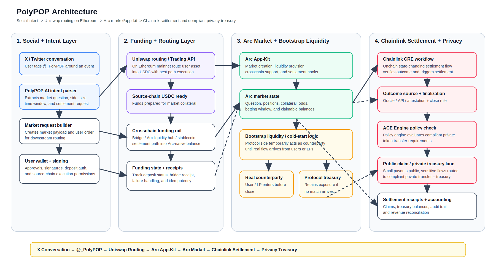

# PolyPOP

PolyPOP turns live disagreement into live markets.
When users are already arguing on X, debating with friends, or seeing two clear sides to a question, they can tag @_PolyPOP to deploy an onchain prediction market directly from the conversation.

## Dependencies

- Arc: liquidity hub / advanced stablecoin logic / crosschain settlement / app-kit
- Uniswap: API routing + bootstrap liquidity demo on Base 
- Chainlink: onchain state-changing settlement flow, ACE Engine, compliant private token transfer


## Design



## Architecture Overview

```
X Conversation → @_PolyPOP → Uniswap Routing → Arc App-Kit → Arc Market → Chainlink Settlement → Privacy Treasury
```

## Arc App-Kit Integration

The Arc App-Kit provides the following features:
- Market creation and management
- Liquidity provision
- Settlement logic
- Cross-chain support


## Uniswap Integration

- Uniswap provides API routing and trading API on eth mainnet

## Chainlink Integration

- Chainlink cre workflow
- ACE Engine.
- Compliant private token transfer.

## Main Files

### Arc App-Kit (Prediction Market / Settlement / Cross-chain)
- `contracts/src/BinaryPredictionMarket.sol` — core prediction market contract
- `contracts/src/BinaryPredictionMarketFactory.sol` — market factory contract
- `contracts/src/interfaces/IBinaryPredictionMarket.sol` — market interface
- `contracts/src/interfaces/ReceiverTemplate.sol` — cross-chain receiver template
- `contracts/src/interfaces/IReceiver.sol` — cross-chain receiver interface
- `server/src/common/services/settlement.ts` — settlement logic
- `server/src/common/services/claim.ts` — claim logic
- `server/src/common/services/bet-listener.ts` — bet event listener
- `server/src/common/services/market-data.ts` — market data service
- `webapp/src/lib/bridge.ts` — cross-chain bridge calls
- `webapp/src/pages/CreatePredictionPage.tsx` / `HackathonCreatePage.tsx` — market creation pages
- `webapp/src/pages/MarketPage.tsx` / `HackathonMarketPage.tsx` — market pages
- `webapp/src/pages/BetPage.tsx` — betting page

### Uniswap (Swap / Trade Routing)
- `webapp/src/lib/uniswap.ts` — Uniswap integration utilities
- `webapp/src/lib/uniswapApi.ts` — Uniswap API routing wrapper
- `webapp/src/pages/SwapPage.tsx` — swap page

### Chainlink (CRE Workflow / ACE Engine / Compliant Private Transfer)
- `cre-workflow/binary-weather/main.ts` — CRE workflow main logic
- `cre-workflow/binary-weather/workflow.yaml` — CRE workflow config
- `cre-workflow/project.yaml` — CRE project config
- `server/src/ace-worker.ts` — ACE Engine worker
- `server/src/common/aceApi.ts` — ACE API (server-side)
- `webapp/src/lib/aceApi.ts` — ACE API (client-side)
- `webapp/src/pages/AceClaimPage.tsx` — ACE compliant transfer claim page
- `server/src/common/services/oracle-listener.ts` — Chainlink oracle listener
- `contracts/src/interfaces/AggregatorV3Interface.sol` — Chainlink data feed interface
- `contracts/src/interfaces/AutomationCompatibleInterface.sol` — Chainlink Automation interface


## One-Line Pitch

**PolyPOP is a social-to-market stablecoin workflow: social disagreement starts on X, Uniswap powers entry routing plus bootstrap liquidity, Arc hosts the market and settlement, and Chainlink resolves and protects sensitive value flows.**


## Links

- X / Twitter: [@_PolyPOP](https://x.com/_PolyPOP)
- Demo: [ETHGlobal](https://ethglobal.com/showcase/polypop-qjuge)

  

Arc：liquidity hub / advanced stablecoin logic / crosschain settlement 

Uniswap：API routing + bootstrap liquidity demo on Base 

Chainlink：onchain state-changing settlement flow 

Privacy(Chainlink Privacy Standard): 
1. Winners can opt into private settlement;
2. Protocol fees can be swept into a private treasury lane


---

## The Problem

Predictions already happen in conversations.

People argue all the time on X about prices, headlines, outcomes, and narratives. But most of those disagreements never become real markets because the user flow is too fragmented:

- the market is not created where the conversation happens
- users may not hold the right asset
- users may not be on the right chain
- settlement is often too heavy or too public
- large payouts and treasury movements expose too much onchain information

---

## The Solution

PolyPOP connects four layers into one clean flow:

1. **X as the social trigger**  
   A tweet, reply, or argument becomes the trigger for a market.

2. **Arc as the market and settlement layer**  
   The prediction market is created natively on Arc and settled in USDC.

3. **Uniswap as the user entry layer**  
   If the user only has ETH on Base, Uniswap converts ETH into USDC automatically.

4. **Chainlink as the resolution and privacy layer**  
   Chainlink CRE resolves the market, and Chainlink privacy capabilities handle large private payout or treasury flows.

---

## Demo Flow

### Step 1 — A disagreement starts on X
Two users publicly argue about an outcome on X.

### Step 2 — A market is created on Arc
PolyPOP turns that disagreement into an Arc-native prediction market.

### Step 3 — A user wants to join, but only has ETH on Base
The user does not need to manually prepare USDC.

### Step 4 — Uniswap converts ETH into USDC
PolyPOP uses the **Uniswap Trading API** to convert the user’s ETH on Base into USDC.

### Step 5 — USDC is bridged to Arc
PolyPOP uses **Arc Bridge Kit** to move USDC from Base to Arc.

### Step 6 — The user joins the market on Arc
The market runs and settles natively on Arc in USDC.

### Step 7 — Chainlink resolves the market
A **Chainlink CRE workflow** verifies the outcome and writes the result onchain.

### Step 8 — Large flows can go private
If a user wins a large amount, or if protocol revenue becomes large, the payout can enter a **privacy-preserving settlement lane** instead of exposing the full value flow publicly.

---

## Why This Design Matters

PolyPOP is not just a prediction market UI.

It is a **stablecoin-native market workflow** that solves three real frictions at once:

- **social friction** — markets should begin where the disagreement already exists
- **asset friction** — users should not need to already hold USDC
- **settlement friction** — high-value payouts should not always be fully public

---


## Architecture

### Social Layer
- X / Twitter conversation
- tweet, reply, mention, or bot trigger
- market request generation

### Market Layer
- Arc-native market factory
- USDC-denominated prediction market
- collateral locking
- claim / settlement state

### Entry Layer
- Base wallet connection
- ETH balance detection
- Uniswap Trading API for ETH → USDC conversion

### Crosschain Transfer Layer
- Arc Bridge Kit
- USDC transfer from Base to Arc

### Resolution Layer
- Chainlink CRE workflow
- outcome verification
- resolution state update

### Privacy Layer
- private payout lane for large winners
- private treasury lane for large protocol revenue
- privacy-preserving workflow for sensitive value flows

---

## Sponsor Mapping

### Arc
Arc is the native market and settlement layer.

PolyPOP uses Arc for:
- market creation
- USDC collateral
- onchain settlement
- programmable stablecoin logic

### Uniswap
Uniswap is the asset entry and execution layer.

PolyPOP uses Uniswap for:
- ETH → USDC conversion
- clean user entry into a stablecoin-settled market
- execution and routing at the point of market entry

### Chainlink
Chainlink is the resolution and privacy layer.

PolyPOP uses Chainlink for:
- market resolution through CRE
- workflow orchestration
- privacy-preserving payout and treasury flows

---

## Key Features

- social-native market creation from X
- Arc-native USDC market settlement
- Base ETH user entry without pre-holding USDC
- automatic ETH → USDC conversion through Uniswap
- Base → Arc USDC bridge flow
- Chainlink-powered resolution
- optional privacy lane for large winner payouts
- optional privacy lane for protocol treasury flows

---

## Technical Stack

### Frontend
- Next.js
- React
- TypeScript
- wallet connection UI

### Smart Contracts
- Solidity
- Arc market factory
- market settlement logic
- claim / payout logic

### Routing and Execution
- Uniswap Trading API
- swap quote + transaction building

### Bridging
- Arc Bridge Kit
- CCTP-based USDC transfer flow

### Oracle / Workflow / Privacy
- Chainlink CRE
- Chainlink Confidential Compute / Confidential HTTP

---

# PolyPOP

**Turn live disagreement into live markets.**

PolyPOP lets users turn an active disagreement on X into an onchain prediction market.  
When users are already arguing, debating with friends, or seeing a question with two clear sides, they can tag **@_PolyPOP** on X to trigger a market creation flow.

The market is created natively on **Arc** and settles in **USDC**.

---


---

## Overview

PolyPOP starts when disagreement already exists.

It could be:
- two users actively arguing on X
- friends debating an outcome
- a live conversation with two clear opposing sides
- a claim that naturally wants a market

Instead of moving to a separate dashboard and manually creating a market, users simply tag **@_PolyPOP** inside the conversation. PolyPOP then turns that live disagreement into an onchain prediction market.

The market itself is created natively on **Arc** and settles in **USDC**.

If a user only has **ETH on Base** and no **USDC on Arc**, PolyPOP first uses **Uniswap** to swap **ETH into USDC on Base**. After that, PolyPOP uses **Bridge Kit + CCTP** to move the USDC from **Base to Arc**, where the user can join the Arc-native market.

Market resolution is handled by **Chainlink**, and large winner payouts or large protocol revenue can optionally move into a **privacy-preserving settlement lane**.

---

## One-Line Pitch

**PolyPOP is a social-native prediction market where live disagreement on X becomes an Arc-native USDC market, Uniswap powers Base-side asset conversion, Bridge Kit + CCTP moves funds into Arc, and Chainlink powers resolution plus privacy-preserving large-value settlement flows.**

---

## How It Works

### 1. A disagreement already exists
PolyPOP does not start from a dashboard.  
It starts when users are already in a disagreement.

### 2. Users tag @_PolyPOP on X
A user tags **@_PolyPOP** in the conversation.  
That interaction becomes the trigger for market creation.

### 3. The market is created on Arc
The prediction market is deployed natively on **Arc** and settles in **USDC**.

### 4. The user may only have ETH on Base
The user does not need to already hold USDC on Arc.

### 5. Uniswap swaps ETH into USDC on Base
If the user only has ETH on Base, PolyPOP uses **Uniswap** to swap **ETH → USDC on Base**.

### 6. Bridge Kit + CCTP moves USDC from Base to Arc
After the Base-side swap is completed, PolyPOP uses **Bridge Kit + CCTP** to move **USDC from Base into Arc**.

### 7. The user joins the Arc-native market
The user enters the market on Arc, and the betting flow is settled in USDC.

### 8. Chainlink resolves the market
Chainlink handles the result verification and resolution workflow.

### 9. Large-value flows can go private
If a winner payout is large, or if protocol revenue becomes large, the value flow can move into a **privacy-preserving settlement lane** rather than exposing everything publicly.

---

## Why PolyPOP Exists

Prediction demand already exists socially.

People constantly argue about:
- whether ETH goes up or down
- whether a headline is bullish or bearish
- whether an event will happen by a deadline
- which side of a claim is right

But most of those disagreements never become real markets because:
- market creation is too heavy
- users do not hold the right stablecoin
- users may not be on the right chain
- there may be no counterparty at the start
- large payouts can expose too much onchain information

PolyPOP reduces all of that friction.

---

## Uniswap Integration

Uniswap is used in **two distinct ways** inside PolyPOP.

### A. Base-side asset conversion
If a user wants to join a market but only holds **ETH on Base**, PolyPOP uses Uniswap to convert that asset into **USDC on Base** before the user enters Arc.

This makes Uniswap a real part of the user entry flow rather than a cosmetic add-on.

### Uniswap API surfaces used
PolyPOP uses Uniswap for:
- **quote generation** for ETH → USDC
- **approval / execution preparation**
- **swap transaction construction and execution**

In PolyPOP:
- **Uniswap handles the swap on Base**
- **Bridge Kit + CCTP handles the movement of USDC into Arc**

Uniswap does **not** bridge funds into Arc.

### B. Extreme cold-start market logic
PolyPOP also uses **Uniswap v4 hooks** for an extreme counterparty case during the betting window.

If a user opens a position before the betting window closes, the protocol can temporarily seed the opposite side and become the provisional counterparty.

During that open betting window:
- other users can still enter
- they can take the other side against the protocol-seeded position
- the protocol only acts as temporary backstop liquidity

If no real counterparty enters before the betting window closes:
- the protocol remains the final counterparty to the initiating user

This is where **Uniswap v4 hooks** is used to customize the lifecycle of the position and counterparty logic.

---

## Cold-Start Market Logic

PolyPOP is designed for live disagreement, which means the first user may arrive before the other side exists.

To solve that, PolyPOP supports a protocol-assisted start:

1. User A opens the initial side of the market
2. the protocol temporarily seeds the opposite side
3. during the betting window, real counterparties can still enter
4. if a real counterparty arrives, the protocol-seeded position can be reduced, replaced, or swapped out
5. if the window closes without a real counterparty, the protocol becomes the final counterparty

This makes the market usable from the very first interaction.


## Key Features

- turn live disagreement into onchain markets
- tag-based market creation through **@_PolyPOP**
- Arc-native USDC settlement
- Base ETH user entry without pre-holding USDC
- Uniswap-powered ETH → USDC swap on Base
- Base → Arc transfer through Bridge Kit + CCTP
- cold-start market support
- Uniswap v4 hook-based counterparty logic
- Chainlink-powered resolution
- optional privacy-preserving payout lane
- optional private treasury lane


